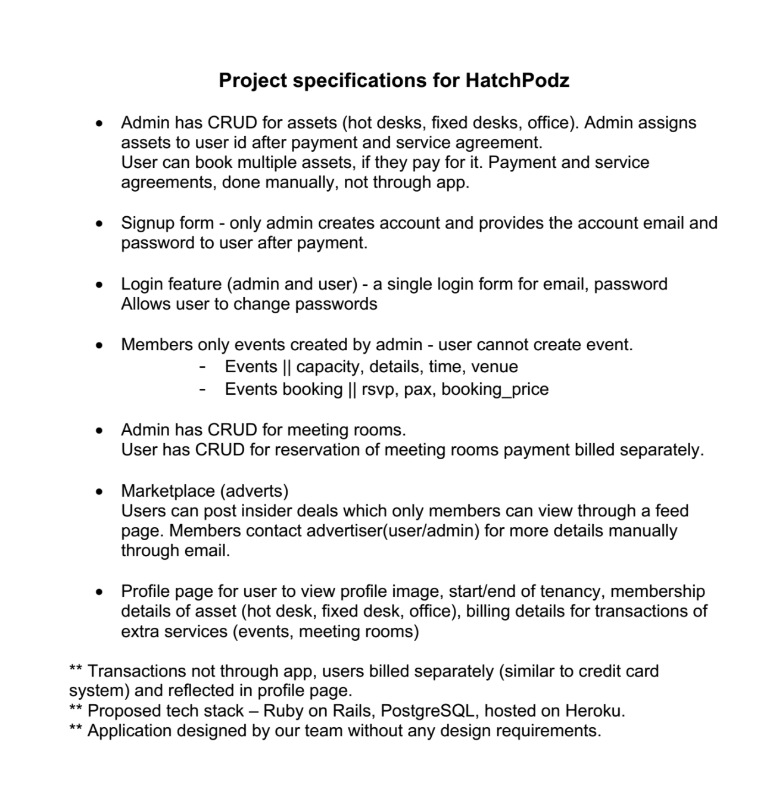
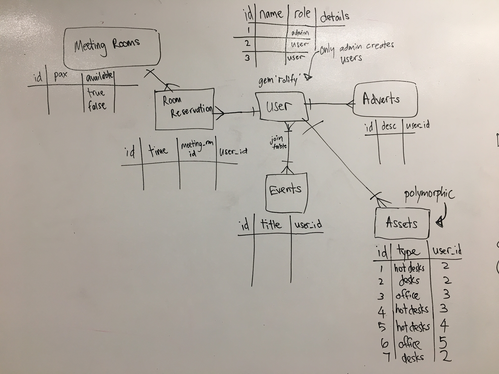
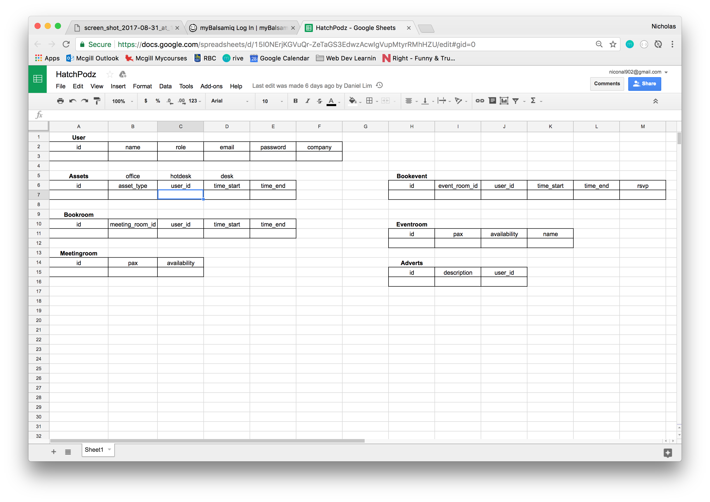
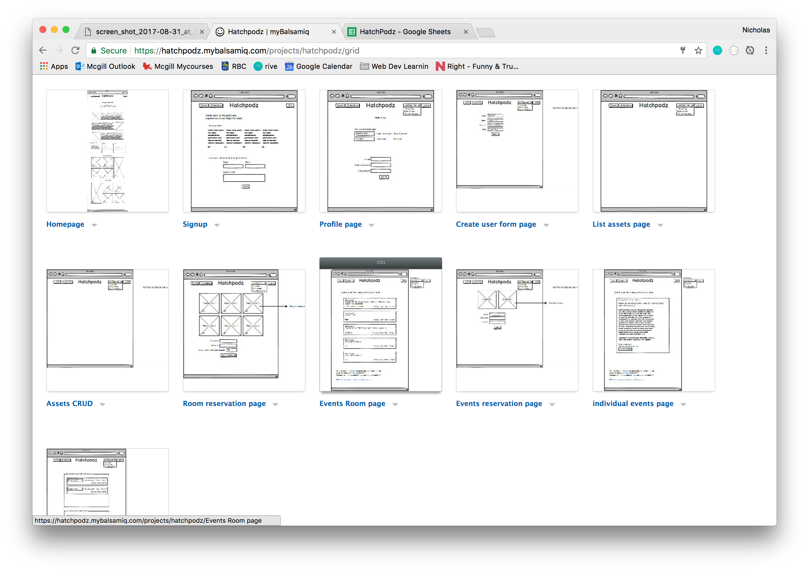
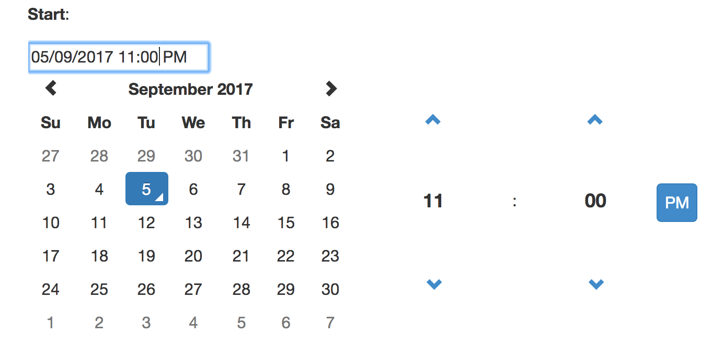
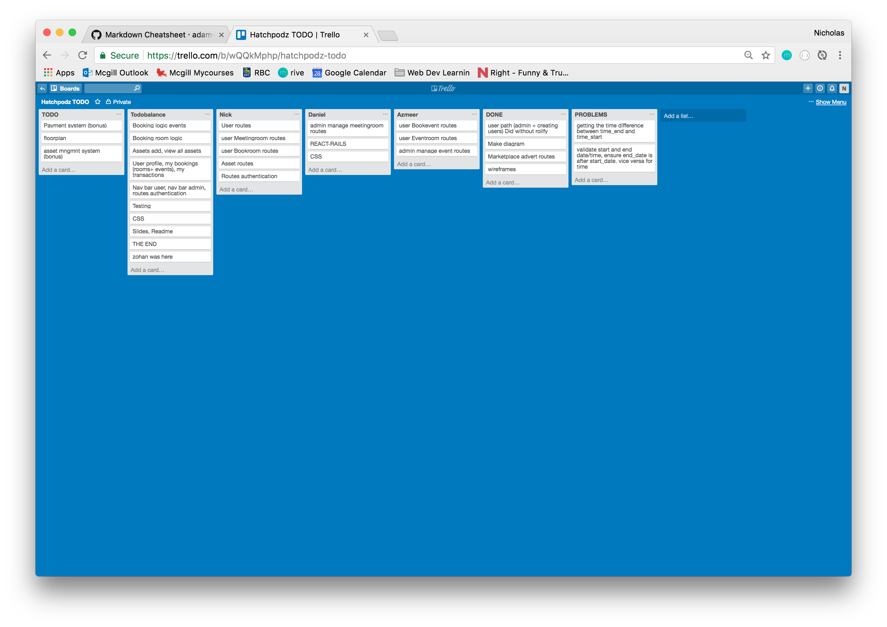

# Hatchpodz

This project is the only client project undergoing completion in WDI 11. It was forwarded by former WDI member Jerel Lim who is interested in starting his own business. This business would be a space where artists and likeminded individuals could rent out in proximity, utilizing facilities to promote their art or individual business. This concept is not unlike Spacemob.

Our job was to create an admin system that would act as a management tool to allow an admin in charge of the facility to keep track of the spaces being utilized by clients. This would involve the following requirements:
* Can keep track of the number of spaces in existance (office, hot-desk, meetingroom, eventroom)
* Can keep track of which member is renting which space.
* A page for advertisements. Only for members, so that they may get inside deals. Members can post.
* Has an admin that has overall control. The admin can create any number of users, as well as other admins.
* Admin can create new spaces, and assign different spaces to different members.
* Admin can create events.
* Admin can make meeting bookings.

---

##### To see our project, here is the [link](https://hatchpodz.herokuapp.com/)!

---

## Our project

### The Beginning

As soon as the our group decided to accept Jerel's project, we met with him over the weekend and then set to work. Our first few interactions involved creating ERDs and figuring out the exact requirements of our client.

*Very, very rough draft*


We then sent the perceived requirements to Jerel to be accepted, so we could synchronize Jerel's vision of the project with the idea that we had for the project.



### ERD and Wireframes

Once everything was client-verified, we began constructing the ERD and the Wireframes. The planning process was slightly complicated due to the fact that there were so many models. We had to make routes for meeting-room bookings, event-room bookings, office/hot-desk/desk bookings, advertisement posting, and admin member generation.



One thing to notice is that we made meeting-room bookings and meeting-rooms two separate models. The reason behind this was that we realized reservations and rooms themselves are two different concepts. An admin can create meeting-rooms which would allow reservations to happen in those meeting-rooms. Reservations for these meeting-rooms would need to be an independent model so that a meeting room could have multiple reservations. The same applies for events.

*The models were then cleaned up into a legible spreadsheet*


We also drafted some basic wireframes for the website.


### Code

A lot of the project was basic rails routing. However, there were some interesting aspects.

In the code below, this was the method we devised to show the users only the time slots that were readily available.
@available_slots holds all possible time slots. The user has to submit the date and room name they want to reserve. This information is used to find all slots that are already reserved on that date and time. The slots are then subtracted from @available_slots to give the remaining slots.

```
def slots
  @available_slots = ['7:00 AM','8:00 AM','9:00 AM','10:00 AM','11:00 AM','12:00 PM','1:00 PM','2:00 PM','3:00 PM','4:00 PM','5:00 PM','6:00 PM','7:00 PM']
  # render json: params
  roomID = Meetingroom.find_by(room_title: params[:bookroom][:meetingroom_id]).id
  @bookroom = Bookroom.new
  @bookroom.meetingroom_id = roomID
  @bookroom.date_start = params[:bookroom][:date_start]

  slots_same_date = Bookroom.where(date_start: params[:bookroom][:date_start])

  taken_slots = slots_same_date.map do |slot|
    slot.slot if slot.meetingroom_id == roomID
  end

  @available_slots = @available_slots - taken_slots
end
```

We also used manual authentication to determine which user was an admin. Each user has a boolean property which displays their admin status.

```
before_action :isAdmin

def isAdmin
  if !current_user.isAdmin
    redirect_to '/'
  end
end
```

### APIs and other external business

#### Bootstrap

Bootstrap was used to give users the ability to choose dates from a calendar that automatically drops down dates and options. All we have to do is use its custom function '.datetimepicker' and attach it to the id or class of any input field.
```
$('#bookRoomDateStart').datetimepicker({
  format: 'DD/MM/YYYY'
})
```



#### Cloudinary

The cloudinary API was used to give users the ability to upload pictures of their event (or advertisement) and display it.
Cloudinary requires us to paste in two functions which we then set to run on click. This uploads the image.

```
function openEventWidgets () {
  cloudinary.openUploadWidget({
    cloud_name: 'ddanielnp',
    upload_preset: 'event_preset',
    multiple: false
  }, function (error, result) {
    console.log(result)
    $('.advert_image').attr('src', result[0].eager[0].secure_url)
    // ruby will autocreate its hidden field with an id (modelName_columnName). form_for is supposed to be used in conjunction with a model, (form_tag is not) so it will create and id using the model name and attribute.
    $('#advert_advert_image').val(result[0].eager[0].secure_url)
  })
}

function openEventWidget () {
  cloudinary.openUploadWidget({
    cloud_name: 'ddanielnp',
    upload_preset: 'event_preset',
    multiple: false
  }, function (error, result) {
    console.log(result);
    $('.event_image').attr('src', result[0].eager[0].secure_url)
    $('#event_event_image').val(result[0].eager[0].secure_url)
  })
}
```
#### Jquery

We used [jQuery](http://jquery.com/) for some of our front end stuff (cloudinary interaction and bootstrap interaction)

#### Ruby

We used ruby on rails for the front end and back end as well.

#### Devise

We used devise for all of our authentications.

### Communications

Our team used trello as a basic means of team management and communication. It allowed us to see what we had completed, what we still had left to do, what each of us were responsible for, and the problems we encounterd on the way.

Our team also used slack to communicate with each other as well as with Prima, our teacher. To communicate with our client, we primarily used email and whatsapp.



### Authors

This project was completed by
* [Daniel Lim](https://github.com/ddanielnp)
* [Azmeer Siddiq](https://github.com/merejarvis)
* [Nicholas Lee](https://github.com/nicoalee)

## Acknowledgments

Thank you Jerel for working with us to finish this project.
Thank you to Prima and Shimei for their tutelage and their educational assistance.
Thank you to all of WDI 11 for their peer support.
