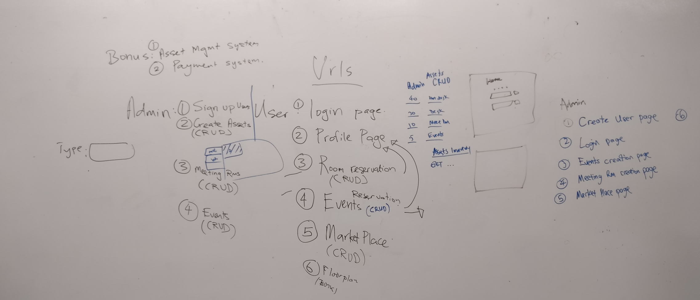

# Hatchpodz

This project is the only client project undergoing completion in WDI 11. It was forwarded by former WDI member Jerel Lim who is interested in starting his own business. This business would be a space where artists and likeminded individuals could rent out in proximity, utilizing facilities to promote their art or individual business. This concept is not unlike Spacemob.

Our job was to create an admin system that would act as a management tool to allow an admin in charge of the facility to keep track of the spaces being utilized by clients. This would involve the following requirements:
* Can keep track of the number of spaces in existance (office, hot-desk, meetingroom, eventroom)
* Can keep track of which member is renting which space.
* A page for advertisements. Only for members, so that they may get inside deals. Members can post.
* Has an admin that has overall control. The admin can create any number of users, as well as other admins.
* Admin can create new spaces, and assign different spaces to different members.
* Admin can create events.
* Admin can make meeting bookings.

---

##### To see our project, here is the [link](https://www.facebook.com)!

Provide instructions here about how to get your project running on our local machine. Do we just need to clone and open a certain file or do we need to install anything first.

---

## Our project

As soon as the our group decided to accept Jerel's project, we met with him over the weekend and then set to work. Our first few interactions involved creating ERDs and figuring out the exact requirements of our client.



```
Code example
```

### How to Use

A step by step guide on how to install and use the project, for example if this is a game, how do we play it.


```
Code example
```

More steps...

```
until finished
```


## Tests

Did you write automated tests? If so, how do we run them.


```
Code example
```

## Live Version

Where is this deployed online (github pages, heroku etc), give us the link and any access details we need.

## Built With

What did you use to build it, list the technologies, plugins, gems, packages etc.

* [jQuery](http://jquery.com/) - jQuery for example is something you likely used

## Workflow

Did you write user stories, draw wireframes, use task tracking, produce ERDs? Did you use source control, with regular commits? Include links to them here.

## Authors

Did you collaborate with others on this project, list them here

* **John McClain** - *Responsible for keeping vests white* - [GithubUserName](https://github.com/GithubUserName)

## Acknowledgments

* Hat tip to anyone who's code was used, for example [this was a useful starting point for creating this template](https://gist.github.com/PurpleBooth/109311bb0361f32d87a2).
